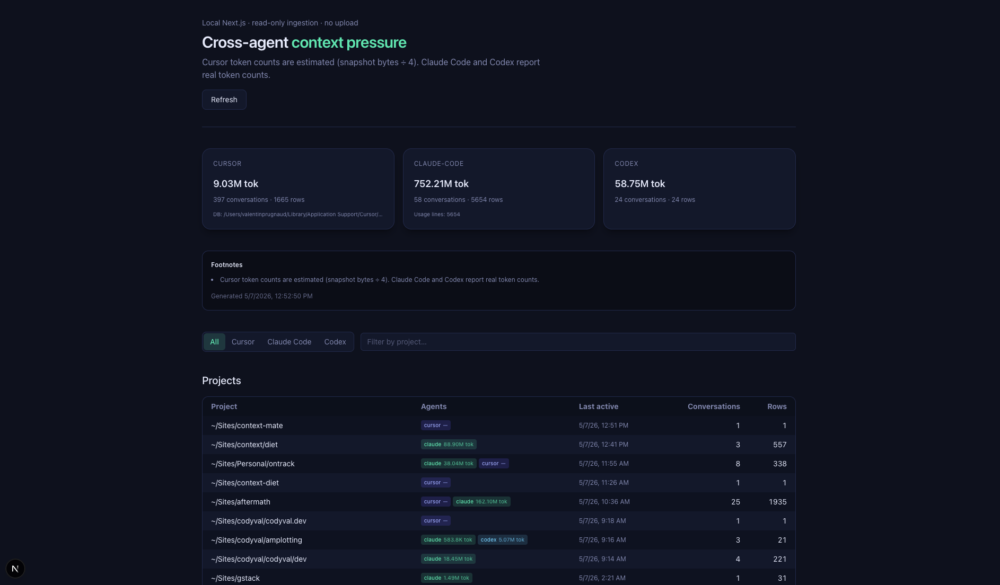

# context-mate

Local web dashboard that tracks **context pressure** across your AI coding agents — Cursor, Claude Code, and Codex — so you can review how context use has played out over time and adjust your strategy in future conversations.



## What it does

- **Cursor** — reads `state.vscdb` (`cursorDiskKV → messageRequestContext:*`), shows each composer's snapshot size broken down into buckets (`webReferences`, `diffsSinceLastApply`, `projectLayouts`, `knowledgeItems`, etc.) with cause tags (user-attached vs auto-injected vs mixed)
- **Claude Code** — parses `~/.claude/projects/**/*.jsonl` transcripts, surfaces token usage per conversation and per turn
- **Codex** — reads the Codex SQLite DB (best-effort)

All three are normalized into a unified model so you can compare projects and conversations side-by-side, sorted by heaviest context first.

## Requirements

- Node 20+
- pnpm

## Install & run

```bash
pnpm install
pnpm dev
```

Open http://localhost:3000.

**JSON export** (same data as the UI): http://localhost:3000/api/context

Query parameters for `/api/context`:

| Parameter | Default | Description |
|---|---|---|
| `db=` | macOS globalStorage path | Path to Cursor `state.vscdb` |
| `redact=1` | off | Redact path-like strings before parsing |
| `cursor=0` | on | Disable Cursor ingestion |
| `claude=0` | on | Disable Claude Code ingestion |
| `codex=0` | on | Disable Codex ingestion |

Save a snapshot to disk:

```bash
curl -s 'http://localhost:3000/api/context?redact=1' -o report.json
```

**Production**

```bash
pnpm build
pnpm start
```

## Caveats

- Cursor's schema is **undocumented** and may change between releases.
- Cursor rows measure **serialized snapshot size** (bytes), not token counts. Claude Code and Codex use token-ish fields from transcripts or SQLite — not directly comparable.
- Read Cursor's DB while Cursor is **idle** so the WAL is checkpointed, or copy `state.vscdb*` and pass `db=` to point at the copy.

## Contributing

See [CONTRIBUTING.md](./CONTRIBUTING.md).

## License

MIT
